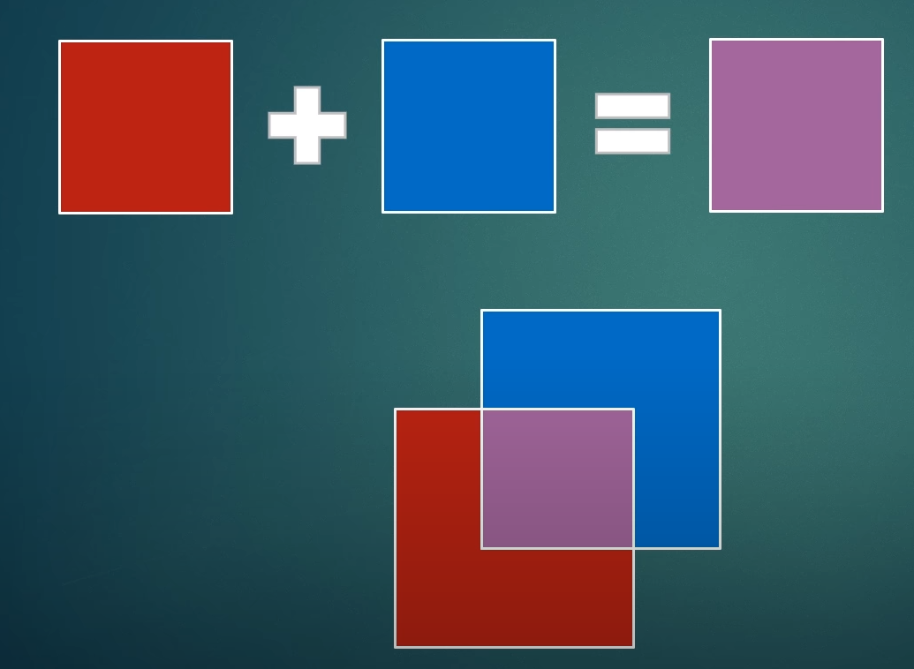

## Texture

### Texture Coordinate

The bottom-left of our screen coordinate is $(0,0)$, and the top-right is $(1,1)$.
Thus, we need to define our shader vertex shader what area of the texture should be
and the fragment shader will interpolate between that area.

## Blending

Blending determines how we **combine** our **output** color with what is already in
our **target buffer**
- **output** = the color we output from our fragment shader(known as **source**)
- **target buffer** = the buffer our fragment shader is drawing to(known as **destination**)



### How do we control blending?

Three functions:
- `glEnable(GL_BLEND)` or `glDisable(GL_BLEND)`
- `glBlendFunc(src, dest)`:
  - `src` = how the src RGBA factor is computed(default is `GL_ONE`)
  - `dest` = how the dest RGBA factor is computed(default is `GL_ZERO`)
- `glBlendEquation(mode)`
  - `mode` = how we combine the `src` and `dest` colors
  - default value is `GL_FUNC_ADD`

which means by default is using the source value:

`1 * src + 0 * dest = src`

if we call the below function in our example:

```CPP
    GLCall(glEnable(GL_BLEND));
    GLCall(glBlendFunc(GL_SRC_ALPHA, GL_ONE_MINUS_SRC_ALPHA));
```

it is,
- `src` = its RGBA.alpha
- `dest` = 1 - `src` alpha

## Math

### Matrix

### Vector

- directional vector
- positional vector